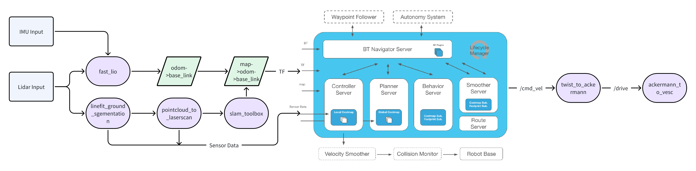
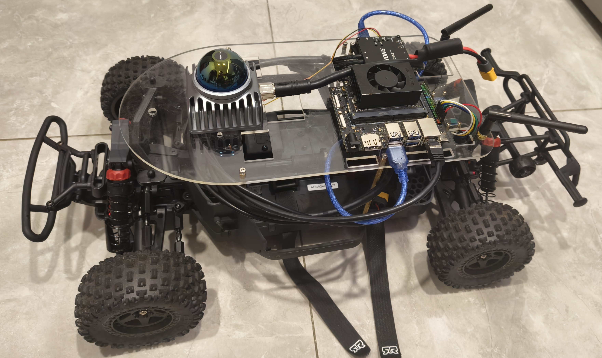

## 一. 环境配置
ARM64 (jetson orin nx)
ubuntu20.04
ROS2 foxy
1. 克隆仓库
   
  ```sh
    git clone --recursive https://github.com/Jialin3/slash_ws.git
  ```
2. 安装 [Livox SDK2](https://github.com/Livox-SDK/Livox-SDK2)
   
    ```sh
    sudo apt install cmake
    ```

    ```sh
    git clone https://github.com/Livox-SDK/Livox-SDK2.git
    cd ./Livox-SDK2/
    mkdir build
    cd build
    cmake .. && make -j
    sudo make install
    ```
    ps：之前用过4g版本的jetson orin nano在多线程编译make -j时会直接卡死

3. 安装依赖
    ```sh
    rosdep install -r --from-paths src --ignore-src --rosdistro $ROS_DISTRO -y
    ```
    ps：大概率rosdep连接超时，手动用二进制apt安装需要的依赖

4. 编译

    ```sh
    colcon build --symlink-install
    ```
    ps：--symlink-instal方便调试参数文件不用二次编译，
        --packages-select编译指定包

## 二. 框架图


## 三. 测试图



