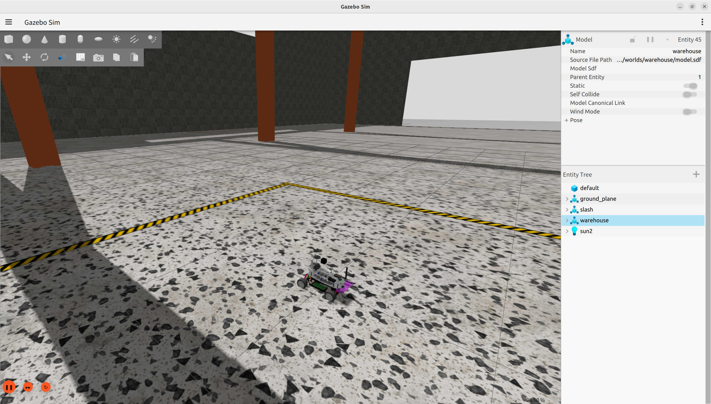
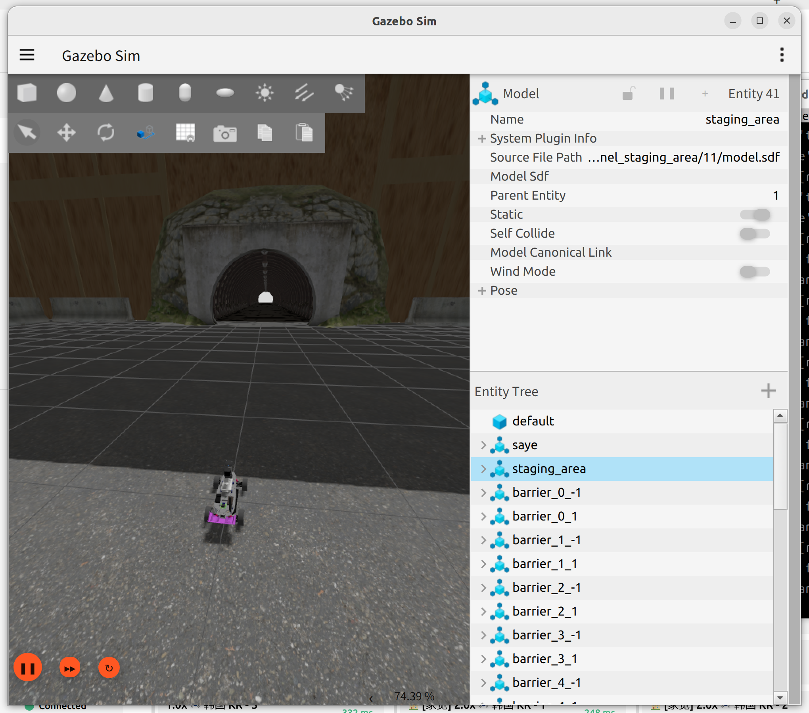
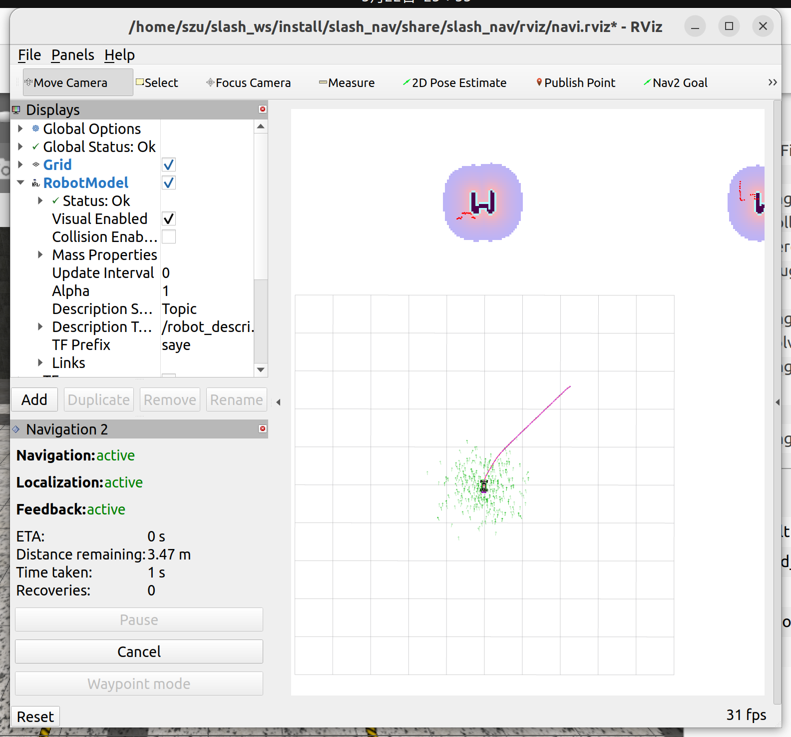

## 一. 环境配置
ARM64 (jetson orin nx)\
ubuntu22.04\
ROS2 humble\
Gazebo Sim Harmonic
1. 克隆仓库
   
    ```sh
      git clone --recursive https://github.com/Jialin3/slash_ws.git -b humble
    ```
2. 安装依赖
    ```sh
    rosdep install -r --from-paths src --ignore-src --rosdistro $ROS_DISTRO -y
    ```
    ps：大概率rosdep连接超时，手动用二进制apt安装需要的依赖
    ```sh
    source slash_ws/src/install_for_humble.sh
    ```

3. 编译并设置环境

    ```sh
    colcon build --symlink-install
    ```
    ps：--symlink-instal方便调试参数文件不用二次编译，
        --packages-select编译指定包
    ```sh
    source slash_ws/src/sim_env.sh
    ```
    ```sh
    source install/setup.bash
    ```

4. 启动\
   gazebo仿真
    ```sh
    ros2 launch slash_gazebo gazebo.launch.py
    ```
    nav导航
    ```sh
    ros2 launch slash_nav nav.launch.py
    ```

## 二. 测试





